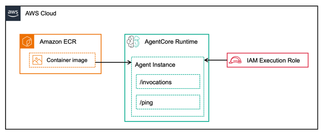

# 在 AgentCore Runtime 上托管 AI 代理

## 概述

本教程演示如何使用 Amazon Bedrock AgentCore Python SDK 在 **Amazon Bedrock AgentCore Runtime** 上托管 AI 代理。学习如何将您的代理代码转换为与 Amazon Bedrock 基础设施无缝集成的标准化 HTTP 服务。

AgentCore Runtime 是一个**框架和模型无关**的平台，可以托管使用任何代理框架（Strands Agents、LangGraph、CrewAI）和任何 LLM 模型（Amazon Bedrock、OpenAI 等）构建的代理。

Amazon Bedrock AgentCore Python SDK 作为一个包装器：

- **转换**您的代理代码为 AgentCore 的标准化协议
- **处理** HTTP 和 MCP 服务器基础设施自动化
- **让您专注于**代理的核心功能
- **支持**两种协议类型：
  - **HTTP 协议**：传统的请求/响应 REST API 端点
  - **MCP 协议**：用于工具和代理服务器的模型上下文协议

### 服务架构

托管代理时，SDK 自动：
- 在端口 `8080` 上托管您的代理
- 提供两个关键端点：
  - **`/entrypoint`**：主要代理交互（JSON 输入 → JSON/SSE 输出）
  - **`/ping`**：用于监控的健康检查

一旦您的代理准备好部署到 AgentCore Runtime，您可以使用 Amazon Bedrock AgentCore StarterKit 将其部署到 AgentCore Runtime。

使用 Starter Kit，您可以配置代理部署，启动它以创建包含代理配置和 AgentCore Runtime 端点的 Amazon ECR 存储库，并调用创建的端点进行验证。

部署后，您在 AWS 中的 AgentCore Runtime 架构如下所示：

## 教程示例

本教程包括三个实践示例，帮助您入门：

| 示例 | 框架 | 模型 | 描述 |
|---------|-----------|-------|--------------------------------------------|
| **[01-strands-with-bedrock-model](01-strands-with-bedrock-model)** | Strands Agents | Amazon Bedrock | 使用 AWS 原生模型的基本代理托管 |
| **[02-langgraph-with-bedrock-model](02-langgraph-with-bedrock-model)** | LangGraph | Amazon Bedrock | LangGraph 代理工作流 |
| **[03-strands-with-openai-model](03-strands-with-openai-model)** | Strands Agents | OpenAI | 与外部 LLM 提供商集成 |

## 主要优势

- **框架无关**：适用于任何基于 Python 的代理框架
- **模型灵活**：支持 Amazon Bedrock、OpenAI 和其他 LLM 提供商
- **生产就绪**：内置健康检查和监控
- **易于集成**：所需代码更改最少
- **可扩展**：为企业工作负载设计

## 入门

根据您首选的框架和模型组合选择上述教程示例之一。每个示例包括：
- 逐步设置说明
- 完整代码示例
- 测试指南
- 最佳实践

## 后续步骤

完成教程后，您可以：
- 将这些模式扩展到其他框架和模型
- 部署到生产环境
- 与现有应用程序集成
- 扩展您的代理基础设施