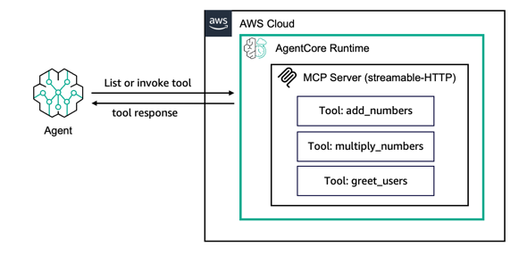

# 在 AgentCore Runtime 上托管 MCP 服务器

## 概述

在本教程中，我们将讨论如何在 Amazon Bedrock AgentCore Runtime 上托管 MCP 工具。

我们将使用 Amazon Bedrock AgentCore Python SDK 将代理函数包装为与 Amazon Bedrock AgentCore 兼容的 MCP 服务器。
它将处理 MCP 服务器的细节，使您可以专注于代理的核心功能。

Amazon Bedrock AgentCore Python SDK 准备您的代理或工具代码以在 AgentCore Runtime 上运行。

它将把您的代码转换为 AgentCore 标准化的 HTTP 协议或 MCP 协议契约，以允许传统请求/响应模式（HTTP 协议）的直接 REST API 端点通信，或用于工具和代理服务器的模型上下文协议（MCP 协议）。

当您托管工具时，Amazon Bedrock AgentCore Python SDK 将实现带有 `MCP-Session-Id` 头的[无状态可流式 HTTP] 传输协议，用于[会话隔离](https://modelcontextprotocol.io/specification/2025-06-18/basic/transports#session-management)，服务器必须支持无状态操作，以不拒绝平台生成的 Mcp-Session-Id 头。
您的 MCP 服务器将托管在端口 `8000` 上，并提供一个调用路径：`mcp-POST`。这个交互端点将接收 MCP RPC 消息，并通过您的工具功能处理它们。它同时支持 application/json 和 text/event-stream 作为响应内容类型。

当您将 AgentCore 协议设置为 MCP 时，AgentCore Runtime 将期望 MCP 服务器容器位于路径 `0.0.0.0:8000/mcp`，因为这是大多数官方 MCP 服务器 SDK 支持的默认路径。

AgentCore Runtime 要求您托管无状态的可流式 HTTP 服务器，因为它默认提供会话隔离，并自动为任何没有 Mcp-Session-Id 头的请求添加该头，这样 MCP 客户端可以与相同的 Bedrock AgentCore Runtime 会话 ID 保持连接的连续性。

`InvokeAgentRuntime` API 的有效负载是完全透传的，因此像 MCP 这样的协议的 RPC 消息可以轻松地被代理。

在本教程中，您将学习：

* 如何创建带有工具的 MCP 服务器
* 如何在本地测试您的服务器
* 如何将您的服务器部署到 AWS
* 如何调用您部署的服务器

### 教程详情

| 信息             | 详情                                                   |
|:--------------------|:----------------------------------------------------------|
| 教程类型       | 托管工具                                             |
| 工具类型          | MCP 服务器                                                |
| 教程组件 | 在 AgentCore Runtime 上托管工具。创建 MCP 服务器 |
| 教程领域   | 跨领域                                            |
| 示例复杂度  | 简单                                                      |
| 使用的 SDK            | Amazon BedrockAgentCore Python SDK 和 MCP Client         |

### 教程架构
在本教程中，我们将描述如何将现有 MCP 服务器部署到 AgentCore runtime。

出于演示目的，我们将使用一个非常简单的 MCP 服务器，它有 3 个工具：`add_numbers`、`multiply_numbers` 和 `greet_users`。

### 教程主要特点

* 托管 MCP 服务器