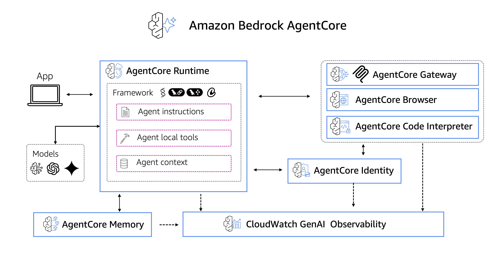

# 📚 Amazon Bedrock AgentCore 教程

欢迎来到 Amazon Bedrock AgentCore 示例仓库的教程部分！

此文件夹包含交互式、基于笔记本的教程，旨在通过实践示例帮助您学习
Amazon Bedrock AgentCore 的基本功能。

我们的教程按 Amazon Bedrock AgentCore 组件组织：

* **Runtime**：Amazon Bedrock AgentCore Runtime 是一种安全、无服务器的运行时功能，使组织能够部署和扩展 AI 代理和工具，无论框架、协议或模型选择如何——实现快速原型设计、无缝扩展和加速上市时间
* **Gateway**：AI 代理需要工具来执行现实世界的任务——从搜索数据库到发送消息。Amazon Bedrock AgentCore Gateway 自动将 API、Lambda 函数和现有服务转换为 MCP 兼容工具，使开发人员无需管理集成即可快速使这些基本功能可供代理使用。
* **Memory**：Amazon Bedrock AgentCore Memory 使开发人员能够轻松构建丰富、个性化的代理体验，具有完全管理的内存基础设施和根据需求自定义内存的能力。
* **Identity**：Amazon Bedrock AgentCore Identity 提供跨 AWS 服务和第三方应用程序（如 Slack 和 Zoom）的无缝代理身份和访问管理，同时支持任何标准身份提供商，如 Okta、Entra 和 Amazon Cognito。
* **Tools**：Amazon Bedrock AgentCore 提供两个内置工具来简化您的代理式 AI 应用程序开发：Amazon Bedrock AgentCore **Code Interpreter** 工具使 AI 代理能够安全地编写和执行代码，提高其准确性并扩展其解决复杂端到端任务的能力。Amazon Bedrock AgentCore **Browser Tool** 是一种企业级功能，使 AI 代理能够导航网站、完成多步骤表单，并在完全管理、安全的沙盒环境中以低延迟执行复杂的基于网络的任务，具有类人精度
* **Observability**：Observability 通过统一的操作仪表板帮助开发人员跟踪、调试和监控代理性能。通过支持与 OpenTelemetry 兼容的遥测和代理工作流每个步骤的详细可视化，Amazon Bedrock AgentCore Observability 使开发人员能够轻松获得代理行为的可见性并大规模维护质量标准。

此外，我们还提供了一个**端到端**示例，展示如何在实际场景中组合这些组件。

## Amazon Bedrock AgentCore

Amazon Bedrock AgentCore 服务可以独立使用或组合使用，以创建生产就绪的代理。它们可以与任何代理框架（如 Strands Agents、LangChain、LangGraph 或 CrewAI）和任何模型一起使用，无论是否在 Amazon Bedrock 上可用。



在这些教程中，我们将学习如何单独和组合使用每个服务。

## 🎯 这些教程适合谁

这些教程非常适合：

 - 开始使用 Amazon Bedrock AgentCore
 - 在构建高级应用程序之前理解核心概念
 - 使用 Amazon Bedrock AgentCore 获得 AI 代理开发的坚实基础

## 设置环境

您需要安装将代理部署到 AgentCore Runtime 的先决条件。按照以下说明设置您的环境：

1. 安装 Docker 或 Finch。您可以在[这里](https://www.docker.com/get-started/)开始
2. 确保您的 Docker 或 Finch 正在运行
3. 为了更好地控制包，强烈建议您创建一个虚拟环境来运行您的应用程序。`uv` 工具是 Python 的高速包和项目管理器。我们建议在此处使用 `uv` 来管理您的环境。您可以按照[这里](https://docs.astral.sh/uv/getting-started/installation/)的说明安装 uv
4. 安装 `uv` 后，使用以下命令创建并激活新环境：
```commandline
uv python install 3.10
uv venv --python 3.10
source .venv/bin/activate
uv init
```
5. 接下来将所需的包添加到您的 `uv` 环境中：
```commandline
uv add -r requirements.txt --active
uv add ipython --active
uv add ipykernel --active
uv add pandas --active
```
6. 您可以使用以下命令从 `uv` 环境启动 Jupyter notebook 实例：
```commandline
uv run --with jupyter jupyter lab
```